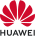

## Introduction

We are a research group at School of Electronic Engineering and Computer Science, Peking University. 

In the broadest sense, our research belongs to the Software Engineering field, which focuses on improving the **efficiency** and **quality** of software development. The software engineering community is diversed in all sorts of ways toward this goal. We often take the **empirical** approach, by observing things in real life and summarizing best practices from experiences. 

More specifically, our current focus is on observing software repositories and measuring how developers live their lives for various purposes, like helping understand and control large complex software systems, society, and universe. We might use a wide spectrum of technologies and interdisplinary methodologies, depending on the specific problem we are tackling with. 

See [the CCF list](https://www.ccf.org.cn/Academic_Evaluation/TCSE_SS_PDL/) for top venues in this field. See [Publications](/publications/) for our latest publications. If you want to learn more, see [Resources](/resources/) in this website.

## Current Research Directions

1. Developer Communication
2. Open Source Sustainbility
3. Company Open Source Participation
4. Open Source Software Supply Chain
5. Mining AI Software Trends
6. Enhancing Source Code Comments

## For Prespective Students

We are constantly looking for self-motivated students with strong programming skills. Students with strong interest in observing open source ecosystems and improving current software development practices are extremely welcomed. Industry experiences and rich software development skills will be your great advantage. Background in software engineering, statistics, visualization, data mining, machine learning and natural language processing might help you prosper in this field but are not necessarily required. 

Contact Professor [Zhou Minghui](http://sei.pku.edu.cn/~zhmh/) for details about PhD openings and undergraduate internship opportunities.

## Industry Collaborators

## Contact

Address: Room 1537, Science Building No. 1, Peking University, Beijing, China

<iframe width="600" height="500" id="gmap_canvas" src="https://maps.google.com/maps?q=peking%20university%20school%20of%20electronic%20engineering&t=&z=17&ie=UTF8&iwloc=&output=embed" frameborder="0" scrolling="no" marginheight="0" marginwidth="0"></iframe>

